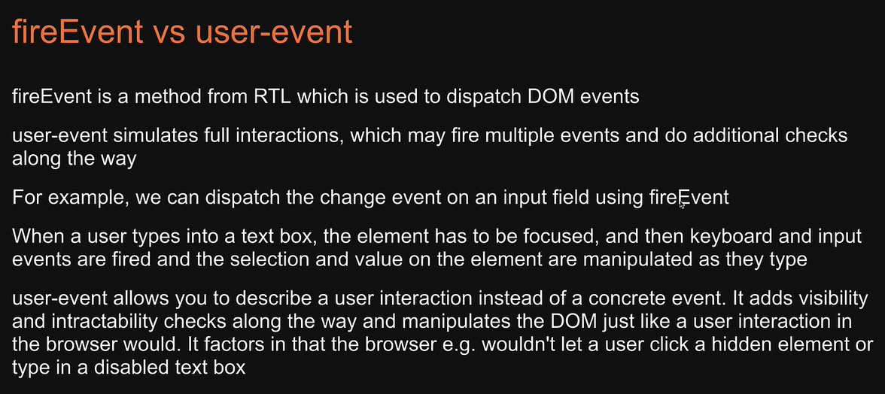

# RTL Tutorial

You can find tutorial on [Codevolution](https://www.youtube.com/watch?v=T2sv8jXoP4s&list=PLC3y8-rFHvwirqe1KHFCHJ0RqNuN61SJd&index=2).

**IMPORTANT**
`CRA installs user-event but needs upgrading!`
- Latest version when writing this repo is:
```bash
npm i @testing-library/user-event@14.4.3
```
You can find different versions [HERE](https://www.npmjs.com/package/@testing-library/user-event)

### Table of contents

- [About tests](#about-tests)
    - [Group tests](#group-tests)
    - [Filename conventions](#filename-conventions)
    - [Assertions](#assertions)
- [What to test](#what-to-test)
    - [What not to test](#what-not-to-test)
- [RTL Queries](#rtl-queries)
    - [Options](#options)
        - [getByRole](#getbyrole)
        - [getByPlaceholderText](#getbyplaceholdertext)
        - [getByText](#getbytext)
        - [getByDisplayValue](#getbydisplayvalue)
        - [getByAltText](#getbyalttext)
        - [getByTitle](#getbytitle)
        - [getByTestId](#getbytestid)
        - [getAllBy](#getallby)
        - [queryBy & queryAllBy](#queryby-&-queryallby)
        - [findBy & findAllBy](#findby-&-findallby)
- [Priority Order for Queries](#priority-order-for-queries)
- [TextMatch](#textmatch)
- [Testing user interactions](#testing-user-interactions)
    - [Pointer interactions](#pointer-interactions)
    - [Keyboard interactions](#keyboard-interactions)
    - [act](#act)
- [Mocking HTTP Requests](#mocking-http-requests)
- [Available Scripts](#available-scripts)
- [Learn more](#learn-more)
- [References](#references)
- [Author Info](#author-info)

## About tests

Jest is a test runner than can:
- find the tests
- run it
- provide user friendly message if test is PASS or FAIL

Run jest: `npm run test`

**test(name, fn, timeout)**
- name: test name used to indentify the test
- fn: function that contains the expectations to test
- timeout: is optional for specifying how long to wait before aborting the test. The default timeout value is 5 seconds.

### Group tests

**describe(name, fn)**
- name: group name used to indentify the group of tests
- fn: function that contains the expectations to test

`test.skip` / `describe.skip` - skips the test or group of tests
`test.only` / `describe.only` - jest picks only that test / group to run

### Filename conventions

- Files with `.test.js` or `.test.tsx` suffix.
- Files with `.spec.js` or `.spec.tsx` suffix.
- Files with `.js` or `.tsx` suffix in **__tests__** folders.

Recommendation is to always put your tests next to the code they are testing so that relative imports are shorter.

We can use `it` instead of `test`.
We can use `fit` instead of `test.only`.
We can use `xit` instead of `test.skip`.

### Assertions

When writing tests, we often need to check that values meet certain conditions.
Assertions decide if a test passes or fails.

Find more about using matchers [here](https://jestjs.io/docs/using-matchers) or in [github repo](https://github.com/testing-library/jest-dom).

## What to test

Guidelines:
- Test if component renders
- Test if component renders with props
- Test if component renders in different states (auth / no auth)
- Test if component reacts to events (buttons, font controls)

### What not to test

- Implementation details - test behaviour not how behaviour is implemented
- Third party code - example: material ui
- Code that is not important from a user point of view

[Back To The Top](#rtl-tutorial)

## RTL Queries

Queries are methods that Testing Library provides to find elements on the page.
Every test we write generally involves the folowing basic steps:

1. Render the component
2. Find an element rendered by the component
3. Assert against the element found in step 2 which will pass or fail the test

To render the component we use `render` method from RTL.

For assertion, we use expect passing in the value and combine it with a matcher function from jest or jest-dom.

To find single element on the page, we have:
- getBy..suffix
- queryBy..suffix
- findBy..suffix

To find multiple elements on the page, we have:
- getAllBy..suffix
- queryAllBy..suffix
- findAllBy..suffix

The suffix can be one of `Role`, `LabelText`, `PlaceHolderText`, `Text`, `DisplayValue`, `AltText`, `Title` and finally `TestId`.

### Options

#### getByRole

Link to all roles usage: https://www.w3.org/TR/html-aria/#docconformance
`getByRole Options`:

- name: The accessible name is for simple cases equal to:
  - the label of a form element
  - the text content of a button
  - the value of the aria-label attribute
- level: Example: for headings
- hidden
- selected
- checked
- pressed

#### getByPlaceholderText

Will search for all elements with placeholder attribute and find one that maches the given text.

#### getByText

Will search for all elements that have node with textContent matching the given text.
Typically, you'd use this to find paragraph, div or span elements.

#### getByDisplayValue

Returns the input, textarea or select element that has the matching display value.

#### getByAltText

Will return the element that has the given alt text.
This method only supports elements which accept an alt attribute like `img`, `input`, `area` or custom html elements.

#### getByTitle

Returns the element that has the matching title attribute.

#### getByTestId

Returns the element that has the matching data-testid attribute.

#### getAllBy

Find multiple elements in the DOM.
Returns an array of all matching nodes for a query, and throws an error if no elements match.

#### queryBy & queryAllBy

`queryBy`:
- Returns the matching node for a query, and return null if no elements match.
- Useful for asserting an element that is not present.
- Throws an error if more than one match is found.

`queryAllBy`:
- Returns an array of all matching nodes for a query, and return an empty array if no elements match.

#### findBy & findAllBy

What if elements are not present in the DOM to begin but make their way into the DOM after some time?
For example, data tha is fetched from a server will be rendered only after a few miliseconds.

`findBy`:
- Returns a promise which resolves when an element is found which matches the given query.
- The promise is rejected if no element is found or if more than one element is found after the default timeout of 1000ms.

`findAllBy`:
- Returns a promise which resolves to an array of elements when any elements are found which match the given query.
- The promise is rejected if no elements are found after the default timeout of 1000ms.

[Back To The Top](#rtl-tutorial)

## Priority Order for Queries
"Your test should resemble how users interact with your code (component, page, etc.) as much as possible"
1. getByRole
2. getByLabelText
3. getByPlaceholderText
4. getByText (Example: for non interactive elements)
5. getByDisplayValue (Example: for pages were inputs are already populated)
6. look at the component code
7. getByAltText
8. getByTitle - is not consistently read by screen readers and is not visible by default for cited users (user cannot hear or see this one)

[Back To The Top](#rtl-tutorial)

## TextMatch

TextMatch represents a type which can be either a:
- string
- regex
- function

### TextMatch - string
`Hello World`
screen.getByText(**"Hello World"**) // full string match
screen.getByText(**"llo World", { `exact`: false }**) // substring match
screen.getByText(**"hello world", { `exact`: false }**) // ignore case

### TextMatch - regex
`Hello World`
screen.getByText(**/World/**) // substring match
screen.getByText(**/world/i**) // substring match, ignore case
screen.getByText(**/^hello world$/i**) // full string match, ignore case

### TextMatch - custom function
`Hello World`
(content?: string, element?: Element | null) => boolean

screen.getByText(**(content) => content.startsWith("Hello")**)

Find multiple elements in the DOM.
Returns an array of all matching nodes for a query, and throws an error if no elements match.

[Back To The Top](#rtl-tutorial)

## Testing user interactions

Difference between fireEvent and user-event:


`user-event`:
- A companion library for Testing Library that stimulates user interfaces by dispatching the events that would happen if the interaction took place in the browser.
- It is recommended way to test user interactions with RTL.

### Pointer interactions

`Convenience APIs` typically used when writting tests.
- click() - is a convenience API that internally calls pointer API
- dblClick() - double click
- tripleClick() - triple click
- hover() - on hover (use example: appearance of tooltips, hover styles,...)
- unhover() - on unhover (use example: appearance of tooltips, hover styles,...)

`Pointer APIs`
- pointer({keys: '[MouseLeft]'}) - left mouse click `OR` pointer('[MouseLeft]') - if keys is the only argument to functions.
- pointer({keys: '[MouseLeft][MouseRight]'}) - left mouse click followed by right mouse click 
- pointer('[MouseLeft>]') - press a button without releasing it
- pointer('[/MouseLeft]') - releasing previously pressed button

### Keyboard interactions

`Convenience API`
- tab() - click TAB on keyboard

`Utility API`
- type()
---
- clear()

---
- selectOptions()

---
- deselectOptions()

---
- upload()

---
`Clipboard API`
- copy()
- cut()
- paste()

`Keyboard API`
- keyboard('foo') // translates to: f, o, o
- keyboard('{Shift>}A{/Shift}') // hold a key -> translates to: Shift(down), A, Shift(up)

### act
Read more about act [HERE](https://reactjs.org/docs/testing-recipes.html#act).

[Back To The Top](#rtl-tutorial)

## Mocking HTTP Requests
We do that with [Mock service worker](https://mswjs.io/docs/).

- [Install instructions](https://mswjs.io/docs/getting-started/install)
- [Integrate instructions with Node](https://mswjs.io/docs/getting-started/integrate/node)

[Back To The Top](#rtl-tutorial)

## Available Scripts

In the project directory, you can run:

### `npm start`

Runs the app in the development mode.\
Open [http://localhost:3000](http://localhost:3000) to view it in the browser.

The page will reload if you make edits.\
You will also see any lint errors in the console.

### `npm test`

Launches the test runner in the interactive watch mode.\
See the section about [running tests](https://facebook.github.io/create-react-app/docs/running-tests) for more information.

### `npm run test:coverage`

`test:coverage in package.json`

```bash
"test:coverage": "npm run test -- --coverage --watchAll --collectCoverageFrom='src/components/**/*.{ts,tsx}' --collectCoverageFrom='!src/components/**/*.{types,stories,constants,test,spec}.{ts,tsx}'"
```

```bash
npm run test:coverage
```

### `npm run build`

Builds the app for production to the `build` folder.\
It correctly bundles React in production mode and optimizes the build for the best performance.

The build is minified and the filenames include the hashes.\
Your app is ready to be deployed!

See the section about [deployment](https://facebook.github.io/create-react-app/docs/deployment) for more information.

### `npm run eject`

**Note: this is a one-way operation. Once you `eject`, you can’t go back!**

If you aren’t satisfied with the build tool and configuration choices, you can `eject` at any time. This command will remove the single build dependency from your project.

Instead, it will copy all the configuration files and the transitive dependencies (webpack, Babel, ESLint, etc) right into your project so you have full control over them. All of the commands except `eject` will still work, but they will point to the copied scripts so you can tweak them. At this point you’re on your own.

You don’t have to ever use `eject`. The curated feature set is suitable for small and middle deployments, and you shouldn’t feel obligated to use this feature. However we understand that this tool wouldn’t be useful if you couldn’t customize it when you are ready for it.

[Back To The Top](#rtl-tutorial)

## Learn More

You can learn more in the [Create React App documentation](https://facebook.github.io/create-react-app/docs/getting-started).

To learn React, check out the [React documentation](https://reactjs.org/).

[Back To The Top](#rtl-tutorial)

## References

- Youtube channel - [Codevolution](https://www.youtube.com/c/Codevolution)

[Back To The Top](#rtl-tutorial)

## Author Info

- LinkedIn - [@nejcrogelsek](https://www.linkedin.com/in/nejcrogelsek/)
- Github - [@nejcrogelsek](https://github.com/nejcrogelsek)

[Back To The Top](#rtl-tutorial)
